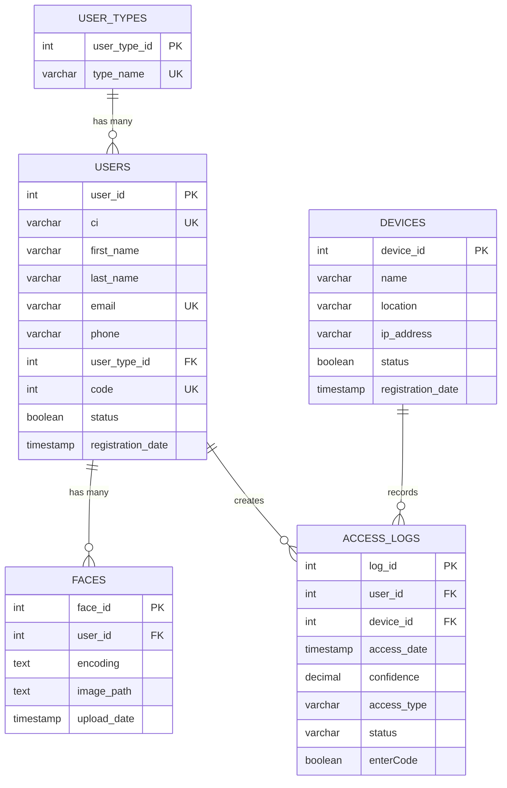

## Overview

BD Scan Face uses a PostgreSQL database managed through Prisma ORM. The schema is designed to support facial recognition-based access control with comprehensive user management, device tracking, and access logging capabilities.

<Note>
The database uses Prisma as the ORM layer, providing type-safe database access and automated migrations.
</Note>

## Schema Architecture

The database consists of five core tables that work together to manage the complete facial recognition access control system:



## Core Models

### UserType Model

Defines the types of users in the system (e.g., Administrator, Employee, Visitor).

```prisma
model UserType {
  user_type_id Int    @id @default(autoincrement())
  type_name    String @unique @db.VarChar(50)

  users User[]

  @@map("user_types")
}
```

**Fields:**
- `user_type_id` (Int): Primary key, auto-incremented
- `type_name` (String): Unique name for the user type (max 50 characters)

**Relationships:**
- One-to-many with `User` model

### User Model

Stores information about system users who can access facilities.

```prisma
model User {
  user_id           Int       @id @default(autoincrement())
  ci                String    @unique @db.VarChar(20)
  first_name        String    @db.VarChar(100)
  last_name         String    @db.VarChar(100)
  email             String    @unique @db.VarChar(100)
  phone             String?   @db.VarChar(20)
  user_type_id      Int
  code              Int       @unique
  status            Boolean   @default(true)
  registration_date DateTime  @default(now())

  user_type   UserType     @relation(fields: [user_type_id], references: [user_type_id])
  faces       Face[]
  access_logs AccessLog[]

  @@map("users")
}
```

**Fields:**
- `user_id` (Int): Primary key, auto-incremented
- `ci` (String): Unique identification document number (max 20 characters)
- `first_name` (String): User's first name (max 100 characters)
- `last_name` (String): User's last name (max 100 characters)
- `email` (String): Unique email address (max 100 characters)
- `phone` (String?): Optional phone number (max 20 characters)
- `user_type_id` (Int): Foreign key to UserType
- `code` (Int): Unique numeric code for manual entry
- `status` (Boolean): Active/inactive status (default: true)
- `registration_date` (DateTime): Timestamp of registration (default: current time)

**Relationships:**
- Many-to-one with `UserType`
- One-to-many with `Face`
- One-to-many with `AccessLog`

### Face Model

Stores facial recognition encodings for users.

```prisma
model Face {
  face_id     Int       @id @default(autoincrement())
  user_id     Int
  encoding    String
  image_path  String?
  upload_date DateTime  @default(now())

  user User @relation(fields: [user_id], references: [user_id])

  @@map("faces")
}
```

**Fields:**
- `face_id` (Int): Primary key, auto-incremented
- `user_id` (Int): Foreign key to User
- `encoding` (String): Base64-encoded facial recognition data
- `image_path` (String?): Optional path to the original face image
- `upload_date` (DateTime): Timestamp of face registration (default: current time)

**Relationships:**
- Many-to-one with `User`

<Note>
Users can have multiple face encodings registered, allowing for different angles or updated photos over time.
</Note>

### Device Model

Represents physical access control devices (cameras, scanners) in the system.

```prisma
model Device {
  device_id         Int       @id @default(autoincrement())
  name              String    @db.VarChar(100)
  location          String?   @db.VarChar(100)
  ip_address        String?   @db.VarChar(50)
  status            Boolean   @default(true)
  registration_date DateTime  @default(now())

  access_logs AccessLog[]

  @@map("devices")
}
```

**Fields:**
- `device_id` (Int): Primary key, auto-incremented
- `name` (String): Device name (max 100 characters)
- `location` (String?): Optional physical location (max 100 characters)
- `ip_address` (String?): Optional IP address (max 50 characters)
- `status` (Boolean): Active/inactive status (default: true)
- `registration_date` (DateTime): Timestamp of device registration (default: current time)

**Relationships:**
- One-to-many with `AccessLog`

### AccessLog Model

Records all access attempts and successful entries in the system.

```prisma
model AccessLog {
  log_id      Int       @id @default(autoincrement())
  user_id     Int?
  device_id   Int
  access_date DateTime  @default(now())
  confidence  Decimal   @db.Decimal(5, 2)
  access_type String?   @db.VarChar(20)
  status      String?   @db.VarChar(20)
  enterCode   Boolean   @default(false)

  user   User?   @relation(fields: [user_id], references: [user_id])
  device Device  @relation(fields: [device_id], references: [device_id])

  @@map("access_logs")
}
```

**Fields:**
- `log_id` (Int): Primary key, auto-incremented
- `user_id` (Int?): Optional foreign key to User (null for unrecognized attempts)
- `device_id` (Int): Foreign key to Device
- `access_date` (DateTime): Timestamp of access attempt (default: current time)
- `confidence` (Decimal): Recognition confidence score (0-100, precision 5,2)
- `access_type` (String?): Optional type of access (max 20 characters)
- `status` (String?): Optional status of the access attempt (max 20 characters)
- `enterCode` (Boolean): Whether manual code entry was used (default: false)

**Relationships:**
- Many-to-one with `User` (optional)
- Many-to-one with `Device` (required)

<Warning>
The `user_id` field is nullable to allow logging of failed or unrecognized access attempts. Always check for null values when querying access logs.
</Warning>

## Constraints and Indexes

### Unique Constraints

The schema enforces several unique constraints to maintain data integrity:

<Tabs>
  <Tab title="UserType">
    - `type_name`: Each user type must have a unique name
  </Tab>
  <Tab title="User">
    - `ci`: Each identification document must be unique
    - `email`: Each email address must be unique
    - `code`: Each numeric code must be unique
  </Tab>
  <Tab title="Other Models">
    Face, Device, and AccessLog models do not have unique constraints beyond their primary keys.
  </Tab>
</Tabs>

### Foreign Key Constraints

All foreign key relationships use the following referential actions:

- **users.user_type_id → user_types.user_type_id**: `ON DELETE RESTRICT ON UPDATE CASCADE`
- **faces.user_id → users.user_id**: `ON DELETE RESTRICT ON UPDATE CASCADE`
- **access_logs.user_id → users.user_id**: `ON DELETE SET NULL ON UPDATE CASCADE`
- **access_logs.device_id → devices.device_id**: `ON DELETE RESTRICT ON UPDATE CASCADE`

<Note>
The AccessLog `user_id` foreign key uses `ON DELETE SET NULL` to preserve historical access logs even if a user is deleted from the system.
</Note>

## Data Types

### PostgreSQL Type Mappings

| Prisma Type | PostgreSQL Type | Usage |
|-------------|-----------------|-------|
| `Int` | `INTEGER` / `SERIAL` | Primary keys, foreign keys, numeric codes |
| `String` | `VARCHAR(n)` / `TEXT` | Names, emails, encodings |
| `Boolean` | `BOOLEAN` | Status flags, boolean indicators |
| `DateTime` | `TIMESTAMP(3)` | Dates and timestamps with millisecond precision |
| `Decimal` | `DECIMAL(5,2)` | Confidence scores with 2 decimal places |

### Field Length Limits

- User Type Name: 50 characters
- User CI: 20 characters
- User Names: 100 characters
- User Email: 100 characters
- User Phone: 20 characters
- Device Name/Location: 100 characters
- Device IP Address: 50 characters
- Access Type/Status: 20 characters

## Next Steps

<CardGroup cols={2}>
  <Card title="Model Details" icon="database" href="/database/models">
    Explore detailed documentation for each model
  </Card>
  <Card title="Migrations" icon="arrow-progress" href="/database/migrations">
    Learn how to manage database migrations
  </Card>
</CardGroup>